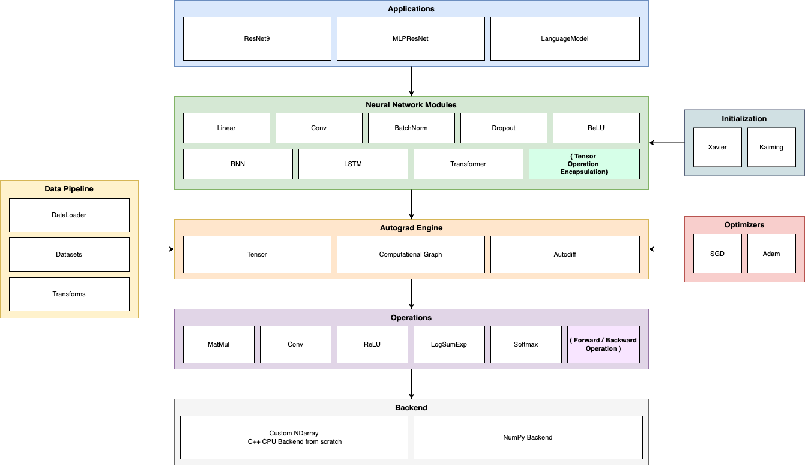

# Needle

A deep learning framework built entirely from scratch -- tensors, autograd, neural network modules, optimizers, and a custom C++ backend. No PyTorch, no TensorFlow, just raw implementations from first principles.

Built as part of Carnegie Mellon University's [10-414/714: Deep Learning Systems](https://dlsyscourse.org/) course.

## Architecture



## What's Inside

### Autograd Engine
Reverse-mode automatic differentiation with a computational graph that tracks operations, builds a topological ordering, and backpropagates gradients.

### Operations
Each op implements both `compute` (forward) and `gradient` (backward):

MatMul, Conv, ReLU, Sigmoid, Tanh, Softmax, LogSumExp, LogSoftmax, Transpose, Reshape, BroadcastTo, Summation, Stack, Split, Flip, Dilate, EWiseAdd, EWiseMul, EWiseDiv, EWisePow, Negate, Log, Exp

### Neural Network Modules
- **Basic**: Linear, Flatten, ReLU, Sigmoid, Softmax, Dropout, BatchNorm1d, BatchNorm2d, LayerNorm1d, Sequential, Residual
- **Convolution**: Conv, ConvBN
- **Sequence**: RNNCell, RNN, LSTMCell, LSTM, Embedding
- **Transformer**: MultiHeadAttention, AttentionLayer, TransformerLayer, Transformer
- **Loss**: SoftmaxLoss

### Backend
A custom strided NDArray that supports views (reshape, permute, slice) without copying memory. Two backends:
- **C++ CPU** -- pybind11 module with 256-byte aligned arrays and tiled matrix multiplication (`src/ndarray_backend_cpu.cc`)
- **NumPy** -- pure Python reference backend for debugging

### Optimizers
- **SGD** with momentum and weight decay
- **Adam** with bias correction and weight decay

### Weight Initialization
Xavier uniform/normal, Kaiming uniform/normal

### Data Pipeline
DataLoader with batching and shuffling, datasets for MNIST, CIFAR-10, and Penn Treebank, and transforms (RandomFlipHorizontal, RandomCrop).

## Example: Transformer Language Model

A transformer-based language model trained on the [Penn Treebank](https://paperswithcode.com/dataset/penn-treebank) dataset for text generation.

```python
import needle as ndl
from models import LanguageModel
from simple_ml import train_ptb, generate_ptb

corpus = ndl.data.Corpus("data/ptb")
train_data = ndl.data.batchify(corpus.train, batch_size=64, device=device, dtype="float32")

model = LanguageModel(
    embedding_size=20, output_size=len(corpus.dictionary),
    hidden_size=32, num_layers=1, seq_model='transformer',
    seq_len=20, num_head=4, dim_head=5, device=device,
)

train_ptb(model, train_data, seq_len=20, n_epochs=10, lr=0.003, optimizer=ndl.optim.Adam)
generate_ptb(model, corpus, "we have", max_len=30, temperature=0.8, device=device)
```

<!-- TODO: training loss plot -->

<!-- TODO: inference example output -->

